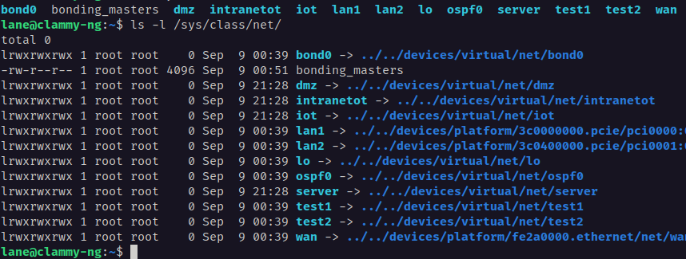
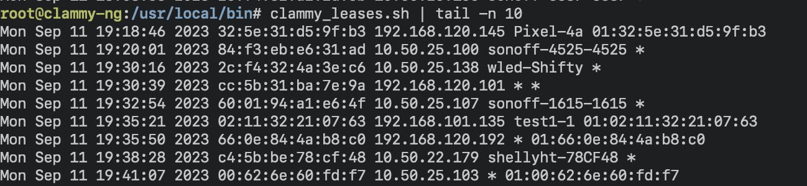
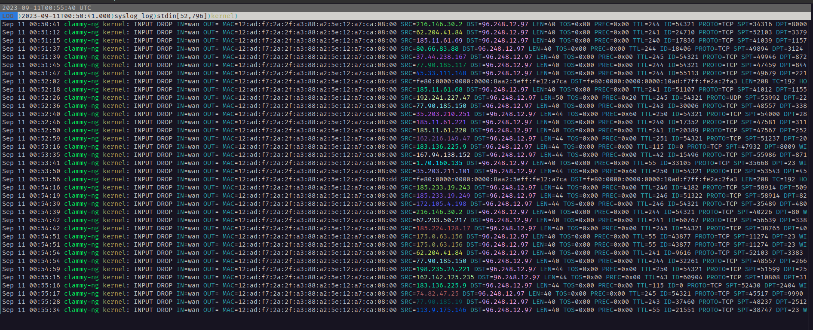

# clammy-ng
The next generation ansible-managed linux router framework using all the trendy new things

## preface

If you dislike systemd. This project is not for you.

## intro

Current device target is a nanopi-r5s running Armbian using a WAN port for internet, and then LAN1 and LAN2 aggregated in a [Router on a stick](https://en.wikipedia.org/wiki/Router_on_a_stick) pattern for east-west traffic.   

This should work on a standard ARM or x86 debian linux system.  Currently targeted at bleeding edge debian side.. Bookworm should work fine.

Desire is to have a robust router config with zone firewall leveraging the following underlying components

*  netplan
*  ~~firewalld~~ [foomuuri](https://github.com/FoobarOy/foomuuri)
*  dnsmasq
*  frrouting
*  wireguard

## functionality status

Currently works:

* wan configuration
* bonidng/LACP config 
* vlan support
* dhcp zones
* dns 
* zone firewall policies
* helper script for leases
* install some helpful tools
  * mtr 
  * bmon
  * vnstat
  * lnav
  * dig
  * batcat
  * clammy_leases.sh


## getting started

This repo is meant to be the ansible project directory.. or close to it plus documentation..  Trying to leverage off-the-shelf roles when possible.  Other roles will via the [clammy collection](https://github.com/lanefu/ansible-collection-clammy)
The roles in the clammy collection need README.md updates, but the defaults/main.yml are very understandable. code should be straight forward

### environment setup

there are better ways, but this way for now...  `.gitignore` has been preconfigured to use namedspace ansible home `~/.clammy-ng-ansible/` and `venv` used in the example.

#### requirements

assume you have python3 and python3-venv installed

```
python3 -m venv venv
source venv/bin/activate
python3 -m pip install requirements.txt
ansible-galaxy install -r requirements.yml
ansible-galaxy install -r requirements-clammy-ng.yml 
```

## approach notes

* everything should be ansible role driven
* only roles in calling playbook ex: full.yml
* all config driven by host_vars or group_vars

### tool selection

* try to use modern linux tools
* no large daemons 
* friendly tui for looking at state on router
* use things like node_exporter and dnsmasq_exporter for visualizing externally

### order of operations

Naturally there's some sequencing challenges with a router.. especially out of the box.  For now `full.yml` is the POC full sequence of operations.
in reality, this stuff will proably want to be decoupled...  

I think there's going to be a generally need to decouple WAN interface-oriented operations from LAN, including firewall management.

approach so far:

1. sanitize some armbian stuff such as removing NetworkManager
1. sysctl_base config # interface specific stuff might move this
1. configure wan interface
1. configure lan interfaces
1. configure vpn interfaces
1. configure wan firewall ingress and port forwards
1. configure lan/vpn zones
1. configure wan/vpn zone policies
1. configure DHCP / DNS (dnsmasq)  # what happens if vpn needs DNS to work?
1. configure advanced routing (frrouting)
1. extra ammenitities
1. configure monitoring


## demo and screenshots


Basic foomuuri poc (without ansible) also shows off nanopi-r5s doing bonding via netplan / clammy-ng config

[](https://asciinema.org/a/oicZHCzBCD3uJET7eZ4Pwrr30)

Updating firewall demo with ansible / clammy-ng

[](https://asciinema.org/a/qOuyMdIWZzd683I7zL0FhFDTD)

Clean interface names thanks to netplan



Handy Script to view dhcp leases



Filter live firewall logs easily with lnav



Bandwidth Monitoring with bmon


