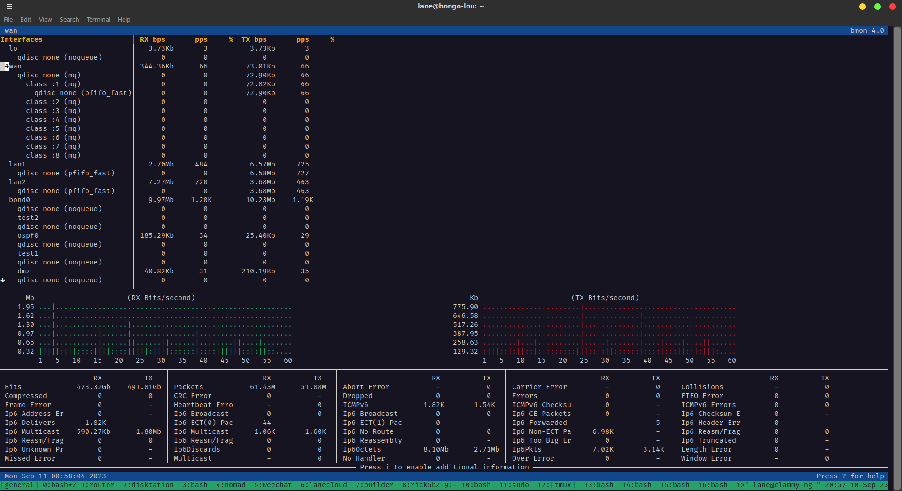

# clammy-ng

The next generation ansible-managed linux router framework using all the trendy
new things

## preface

If you dislike systemd. This project is not for you.

## intro

Current device target is a nanopi-r5s running Armbian using a WAN port for
internet, and then LAN1 and LAN2 aggregated in a
[Router on a stick](https://en.wikipedia.org/wiki/Router_on_a_stick) pattern for
east-west traffic.

This should work on a standard ARM or x86 debian linux system. Currently
targeted at Debian Trixie. Foomuuri is not in the bookworm repo, it would be
easy to modify the foomuuri role to install from source, but hasn't been done.

Desire is to have a robust router config with zone firewall leveraging the
following underlying components:

- netplan
- [foomuuri](https://github.com/FoobarOy/foomuuri)
- dnsmasq
- unbound
- chrony
- frrouting
- wireguard

## functionality status

Currently works:

- wan configuration
- bonidng/LACP config
- vlan support
- dynamic routing via frrouting
- dhcp zones
- dns
- dns filtering using unbound rpz files
- ntp server with chrony
- zone firewall policies
- dynamic dns client setup
- helper script for leases
  - clammy_leases.sh
- armbian adjustments
  - irqbalance
  - schedutil governor
- install some helpful tools
  - mtr
  - bmon
  - vnstat
  - lnav
  - dig
  - batcat
  - gping
  - btop

## getting started

This repo is meant to be the ansible project directory.. or close to it plus
documentation.. Trying to leverage off-the-shelf roles when possible. Other
roles will via the
[clammy collection](https://github.com/lanefu/ansible-collection-clammy) The
roles in the clammy collection need README.md updates, but the defaults/main.yml
are very understandable. code should be straight forward

### environment setup

There are better ways, but this way for now... `.gitignore` has been
preconfigured to use namedspace ansible home `~/.clammy-ng-ansible/` and `venv`
used in the example.

#### requirements

assume you have python3 and python3-venv installed

```
python3 -m venv venv
source venv/bin/activate
python3 -m pip install -r requirements.txt
ansible-galaxy install -r requirements.yml
ansible-galaxy install -r requirements-clammy-ng.yml
```

## approach notes

- everything should be ansible role driven
- components should be a le carte so users can choose what they need.
- only roles in calling playbook ex: full.yml
- all config driven by host_vars or group_vars

### tool selection

- try to use modern linux tools
- no large daemons
- friendly tui for looking at state on router
- use things like node_exporter and dnsmasq_exporter for visualizing externally

## Examples

- See the [full.yml playboook](full.yml) for a default playbook that applies all
  roles.
- See the [nanopi-r5s host var](host_vars/nanopi-r5s.yml) for configuration
  example of all functionality.

## Quirks

### netplan

Calling the netplan role twice is a little awkward since it really targets all
netplan yaml files on netplan execution. It was more hygienic to have separate
files files for the interfaces. This could be improved.

### Debian

I've been developing this against an Armbian build of Debian Trixie, and the
process has been quite smooth. I've been utilizing the rolling release for over
18 months, even when Trixie was still in the sid branch. This should function
correctly with a standard Debian Trixie installation as well. While Foomuuri
isn't directly available in the Debian Bookworm repositories, the role could be
easily adapted to install it from source. However, my primary target for this
project is Debian Trixie.

## demo and screenshots

Updating firewall demo with ansible / clammy-ng


Clean interface names thanks to netplan


Handy Script to view dhcp leases


Filter live firewall logs easily with lnav


Bandwidth Monitoring with bmon


